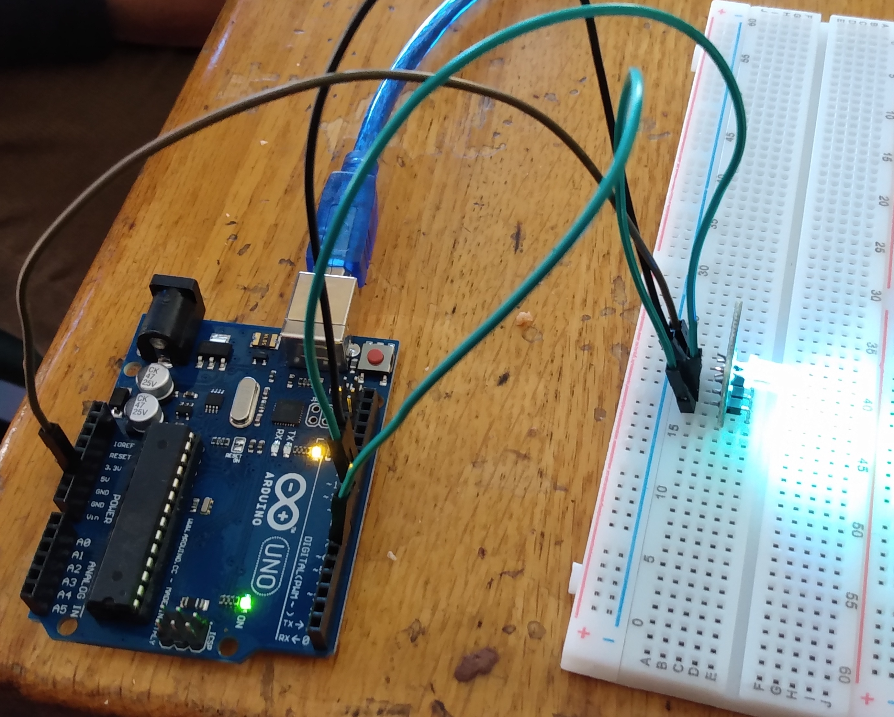
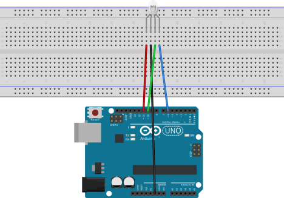
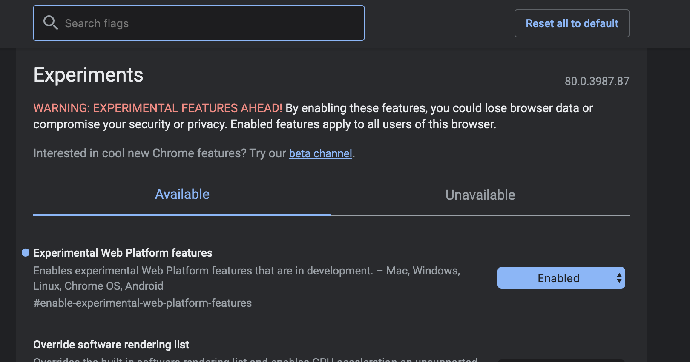

# Svelte Arduino Color Picker



## Arduino Setup



1. Red Wire goes to pin 11

2. Green Wire goes to pin 10

3. Blue Write goes to pin 6

4. Upload [Sketch](/arduino.ino) to Arduino

```cpp
int redPin = 11;
int greenPin = 10;
int bluePin = 6;

void setup() {
  // put your setup code here, to run once:
  pinMode(redPin, OUTPUT);
  pinMode(greenPin, OUTPUT);
  pinMode(bluePin, OUTPUT);
  Serial.begin(115200);
}

void loop() {
  // put your main code here, to run repeatedly:
  String usbMessage = Serial.readStringUntil("|");
  if (usbMessage != "") {
      int redColor = getValue(usbMessage, ':', 0).toInt();
      int greenColor = getValue(usbMessage, ':', 1).toInt();
      int blueColor = getValue(usbMessage, ':', 2).toInt();
      analogWrite(redPin, redColor);
      analogWrite(bluePin, blueColor);
      analogWrite(greenPin, greenColor);
      delay(50);
  }
}

String getValue(String data, char separator, int index)
{
    int found = 0;
    int strIndex[] = { 0, -1 };
    int maxIndex = data.length() - 1;

    for (int i = 0; i <= maxIndex && found <= index; i++) {
        if (data.charAt(i) == separator || i == maxIndex) {
            found++;
            strIndex[0] = strIndex[1] + 1;
            strIndex[1] = (i == maxIndex) ? i+1 : i;
        }
    }
    return found > index ? data.substring(strIndex[0], strIndex[1]) : "";
}
```

## Web Setup

1. Turn on experimental web stuff in chrome by going to chrome://flags



2. Upload the arduino.ino sketch file to the arduino.

3. Setup Project

```
git clone https://github.com/phptuts/arduino-svelte-color-picker.git
cd arduino-svelte-color-picker
npm install
npm run dev
```

5. Go to http://localhost:5000

6. Click Connect To Arduino and select the arduino usb port.


7. Change the color.


